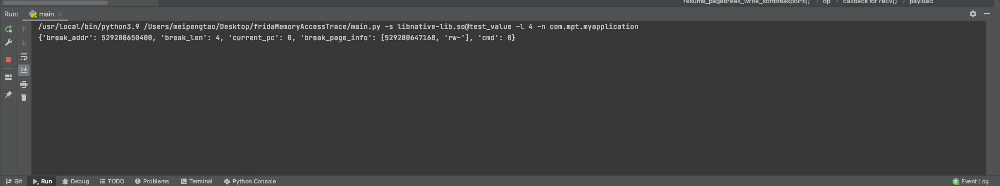

# fridaMemoryAccessTrace
android memory access trace utility powered by frida framework
## Start
```
usage: main.py [-h] -l LENGTH [-n NAME] [-lp] (-b BREAK | -o OFFSET | -s SYMBOL)

optional arguments:
  -h, --help            show this help message and exit
  -l LENGTH, --length LENGTH
                        breakpoint length can not over pagesize
  -n NAME, --name NAME  process name
  -lp, --listproc       list process
  -b BREAK, --break BREAK
                        absolute address, eg. 0x12345678
  -o OFFSET, --offset OFFSET
                        relative address, eg. libxxx.so@0x1234
  -s SYMBOL, --symbol SYMBOL
                        get address by symbol eg. libxxx.so@test_value

```
## Test Native Code

```c
_Noreturn void* thread_1(void * arg){
    while (true){
        for (int i =0;i<4;i++){
            *((char *)&test_value+i) = *((char *)&my_test+i);
        }
        test_value++;
        sleep(1);
    }
}
 pthread_create(&thread1, nullptr, thread_1, nullptr);
```

## Test example
- need to install **hexdump** module
```sh
#64 bit architecture
adb install -t ./app-debug64.apk
python3 ./main.py -s libnative-lib.so@test_value -l 4 -n "My Application"

#32 bit architecture
adb install -t ./app-debug32.apk
python3 ./main.py -s libmyapplication32.so@test_value -l 4 -n MyApplication32
```
**64 bit architecture**

**32 bit architecture**


## Known problem
- crash probably when multi thread access
